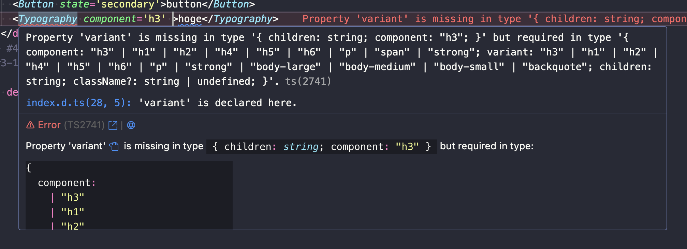
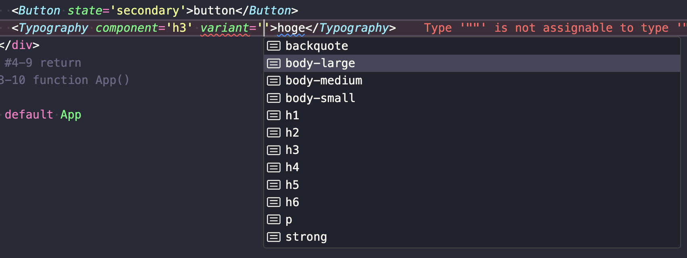
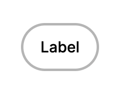

# plesiosaurus/ui

A simple & animate-full UI component library built with vanilla-extract.🍦🩵

**❄️It's fully Vanilla-Essenced React component library!!❄️**

## 🦖 Configurations - It's a tiny little step before you go ahead!

- Simply add `"resolvePackageJsonExports": false,` in `compilerOptions` in `tsconfig.json` property like this:

```json
   "compilerOptions": {
      // ...
      "resolvePackageJsonExports": false,
      // ...
   },
```

... then you're good to go!
You got a fully-typed React UI Component.

## 🏹Usage

In your app, you're able to use @plesiosaurus/ui Components like so:

```ts
import { Button } from '@plesiosaurus/ui'

function App() {
  return (
    <div>
      <Button state='secondary'>Label</Button>
    </div>
  )
}

export default App
```

As it's fully typed, you got a tweet from your IDE if you're missing something necessary.


Don't worry if you're not sure what variants are available.@plesiosaurus/ui Components allow you to know what you can put in there!


Hooray🌟 Now, @plesiosaurus/ui Components are in your hands!



## 🌈Technical Features

### 🌳Fully tree shakeable

Only necessary code ends up in the final application. When you import a component, it only includes the necessary JS and CSS styles. It's pretty cool, isn't it?

### 🐣Compiled CSS modules

The components are styled with [vanilla-extract](https://vanilla-extract.style/). When building the library, these styles will get transformed to normal CSS style sheets. This means that the consuming application will **not even be required to support CSS modules!**

As a bonus compiling the vanilla-extract avoids a compatibility issue and the package can be consumed in both, environments that support named imports for vanilla-extract, and environments that don't. That means **using compiled CSS allows for obtaining the minimal CSS in both environments that support named imports and those that do not!**

### 🦖TypeScript

To include type definitions in our UI library, we successfully developed the library using a statically typed language such as TypeScript. We exported type definition to `@plesiosaurus/ui/types/**.d.ts` files (files with the .d.ts extension) as part of the build process. **This enables users to benefit from features like code completion and type checking when using the UI library.**

## 📛 Catalog

[Component Documentation on Storybook](https://6554b17cdf2d7f453e222014-awwkotauff.chromatic.com/)
